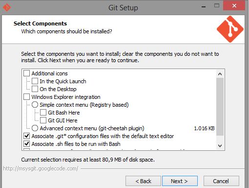
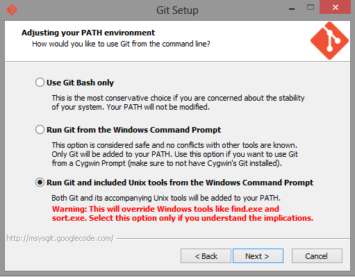
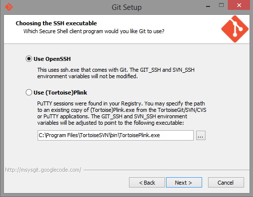
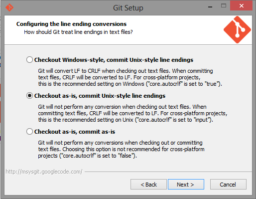
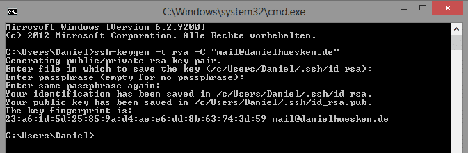
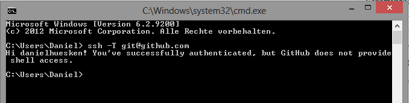

# Git für Windows installieren und SSH Keys nutzen

Ich benutze für die Installation die Aktuelle Preview Version von [msysgit](http://msysgit.github.io/) ([Git-1.8.3-preview20130601.exe](https://code.google.com/p/msysgit/downloads/detail?name=Git-1.8.3-preview20130601.exe&can=2&q=full+installer+official+git)).

Da ich nur die Kommandozeilen Komponenten benötige, habe ich die “Windows Explorer integration” abgewählt.

Hier verwende ich extra “Run Git and included Unix tools form Windows Command Promt”, damit ich Git in der Kommandozeile laufen lassen kann ohne den Pfad der Git Datei angeben zu müssen. Außerdem ist das der einzige Punkt, bei dem dann die SSH Authentifizierung vernünftig funktioniert.

Ich benutze das von Git mitgelieferte OpenSSH.

Wir verwenden immer die “Unix-style line endings”. Dies kann man aber auch projektweise mit Hilfe einer .gitattributes definieren.

Danach wird Git installiert und man kann es in der Windows cmd nutzen. Ich nutze es direkt in der IDE [PHPStorm](http://www.jetbrains.com/phpstorm/).

Um Git jetzt noch mit SSH Zertifikaten laufen zu lassen, müssen wir nur noch der [Anleitung](https://help.github.com/articles/generating-ssh-key) folgen, die ich hier nochmal kurz durchgehe.

**Punkt 1**: Überprüfen, ob schon SSH Keys exisitieren. Diese sollten unter `C:\Users\<Benutzername>\.ssh` zu finden sein und im Normalfall id_rsa und id_rsa.pub heißen.

Wenn schon welche existieren, kann Punkt 2 übersprungen werden.

**Punkt 2**: SSH Key erstellen, indem man in der Kommandozeile folgenden Befehl eingibt.

`ssh-keygen -t rsa -C "your_email@example.com“`

Es sollte diese Meldung erscheinen:

`Enter file in which to save the key (/c/Users/<Benutzername>/.ssh/id_rsa):`

Diese mit Enter bestätigen. außer dort ist nicht der oben angegebene Pfad angegeben, dann diesen ändern in *“C:\Users\<Benutzername>\.ssh\id_rsa”* und mit Enter bestätigen.

Dann wird noch nach einer “passphrase” gefragt; hier bestätige ich einfach 2 mal.

Zum Schluss muss eine Meldung erscheinen, die lautet “The key fingerprint is: …” dann sollte das Erstellen geklappt haben, wenn keine Fehlermeldung aufgetaucht ist.

Hier noch ein Screenshot mit der cmd:

**Punkt 3**: Jetzt muss man noch den erstellten Key bei [Github](https://github.com/settings/ssh) oder anderem Git dienst eintragen.

Dazu öffnet man die eben erstellte *“C:\Users\<Benutzername>\.ssh\id_rsa.bup”* mit dem Winows Editor und kopiert den Inhalt der Datei eins zu eins bei Github in das Key Feld, welches erscheint, wenn man auf Add Keys klickt. Den Namen kann man leer lassen, da dieser automatisch eingetragen wird.

**Punkt 4**: Testen, ob der Key akzeptiert wird, macht man indem man nochmal die cmd öffnet und folgenden Befehl eingibt: `ssh -T git@github.com`

Wenn die Meldung *“The authenticity of host ‘github.com (207.97.227.239)’ can’t be established. RSA key fingerprint is 16:27:ac:a5:76:28:2d:36:63:1b:56:4d:eb:df:a6:48. Are you sure you want to continue connecting (yes/no)?”* erscheint einfach yes eingeben und bestätigen.

Wenn alles geklappt hat, sollte eine Meldung wie im Screenshot erscheinen.

Damit kann mit Git mit SSH ohne Passworteingabe nutzen. Wichtig ist natürlich, dass man die Repros per SSH cloned und nicht per http.

Update 13.04.2015: Ich muss neuerdings die Umgebungsvariable `set HOME=%HOMEDRIVE%%HOMEPATH%` setzen damit ich mich über ssh authentifizieren kann. Die habe ich in den Windows Umgebungsvariablen bei meinem Benutzer gesetzt.

Geschrieben: 12.06.2013