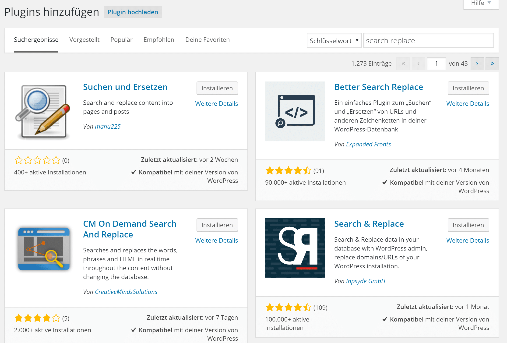

# WordPress Blog manuell von http auf https umstellen

Hier möchte ich kurz beschreiben wie man seinen WordPress Blog von http:// auf https:// umstellen kann. **Voraussetzung ist, dass für die Blog Domain bereits ein Zertifikat eingerichtet ist.** Also die Domain schon unter **https://domain.tld** erreichbar ist. Die Website, die ich hier für die Umstellung nehme, ist die von meinem Schwager, da ich meine bereits umgestellt habe.

Es wird nicht nur das Backend umgestellt, sondern die ganze Webseite.
müssen auch keine Konstanten in der `wp-config.php` definiert werden.
Durch das umstellen der ganzen Webseite wird sich das positiv auf das Google Ranking auswirken und auch Besuchern eine höhere Sicherheit angezeigt. Natürlich kommt hinzu, dass keine Daten mehr unverschlüsselt übertragen werden, was ja nicht nur bei Shops interessant ist.

Zur Umstellung:

Im Backend unter “Einstellungen > Allgemein” die URLs von http://… aud https://… ändern und Speichern. Danach wieder neu Anmelden.
Falls die Felder ausgegraut sind habt ihr diese in der wp-config.php definiert und müsst sie dort ändern.


Eigentlich war das schon das wesentliche. Allerdings müssen wir jetzt noch den bestehenden Content anpassen. Dies machen wir mittels Search&Replace in der Datenbank.

Ich verwende dafür, da es sich für mich bewährt das [Better Search Replace](https://de.wordpress.org/plugins/better-search-replace/) Plugin. Also das Plugin installieren und Aktivieren.

Dann unter “Werkzeuge > Better Search Replace” öffnen. Bei “Suchen nach” die Alte Blog URL eintragen und bei “Ersetzen durch” die gleiche URL nur mit https. Bitte immer die vollständige Blog URL verwenden da es sonst zu Problemen kommen kann.
Danach alle Tabellen auswählen und den Haken bei “Auch GUIDs ersetzen” setzen. Es kann nach Wunsch auch erst ein Testlauf gemacht werden. Damit die Änderungen endgültig durchgeführt werden, muss der Haken auf jeden Fall entfernt werden.
Man sollte vorher natürlich seine Datenbank sichern!


Nachdem die Änderungen durchgeführt wurden erscheint folgende Meldung


Damit sollten jetzt alle Blog URLs von http auf https umgestellt sein und das Plugin kann wieder deaktiviert und deinstalliert werden.

In Chrome sollte die Webseite dann mit einem grünen Schloss angezeigt werden.
Wenn nicht alle Inhalte mittels https ausgeliefert werden, ist das Schloss grau und nicht grün. Man erhält in der URL-Leiste einen Hinweis. Wenn das der Fall ist, muss noch in seinen Anpassungen (Widgets, PHP Dateien, usw.) suchen, ob dort noch URLs enthalten sind, die nicht mit https anfangen und diese umstellen.


Zusätzlich sollte man jetzt noch alle Aufrufe der Webseite auf die https URL umleiten. Dafür kann man mit folgendem Eintrag zusätzlich in die .htacssess einfügen.
```
<IfModule mod_rewrite.c>
    RewriteEngine On
    RewriteCond %{HTTPS} off
    RewriteRule (.*) https://%{HTTP_HOST}%{REQUEST_URI} [R=301,L]
</IfModule>
```
Viel Spaß beim Umstellen.

Geschrieben: 25.05.2016